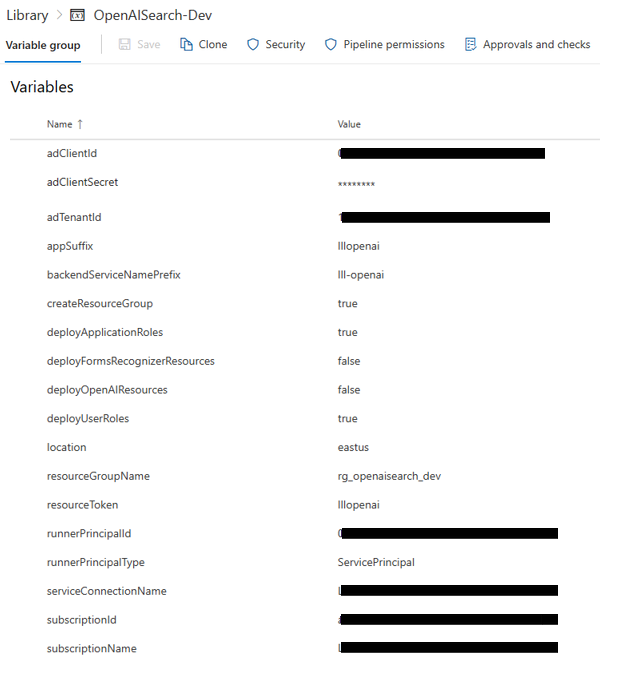

# OpenAI Search Demo Azure DevOps Deployment Template Notes

## Workflow Credentials

To run the bicep deploy workflow, the service principal that is running the workflows needs Owner rights at the subscription level. If Owner cannot be granted, then at a minimum it needs Contributor and User Access Administrator roles.

The service principal that is running the workflows will assign these rights at the subscription level in order to process the documents:

- Forms Recognizer
  - Cognitive Services OpenAI user
  - Cognitive Services User
- Search Service
  - Search Index Data Contributor
- Storage
  - Storage Blob Data Contributor

---

## 2. Azure DevOps Template Definitions

Typically, you would want to set up either Option (a), or Option (b/c/d), but not all four jobs.

- **infra-and-website-pipeline.yml:** Deploys the main.bicep template, builds the website code, then deploys the website to the Azure App Service, and creates the search index
- **infra-only-pipeline.yml:** Deploys the main.bicep template and does nothing else
- **website-only-pipeline.yml:** Builds the website and then deploys the website to the Azure App Service and does nothing else
- **update-search-only-pipeline.yml:** Updates the search index with the latest document data and does nothing else

---

## 3. Deploy Environments

These YML files were designed to run as multi-stage environment deploys (i.e. DEV/QA/PROD). Each Azure DevOps environments can have permissions and approvals defined. For example, DEV can be published upon change, and QA/PROD environments can require an approval before any changes are made.

In the four pipeline files shown in the previous section, specify the environments that are to be targeted like this:

``` bash
    environments: ['DEV','QA','PROD']
```

---

## 4. Setup Steps

- Create Azure DevOps Service Connection

- Create Azure DevOps Environments

- Create Azure DevOps Variable Group (see next section for details)

- Create Azure DevOps Pipeline(s) and associate the Variable Group

- Run the infra-and-website-pipeline.yml pipeline to deploy the project to an Azure subscription.

---

## 5. Variable Group Contents

Create a variable group named 'OpenAISearch' with the values below, either manually or by customizing and running this command in the Azure Cloud Shell.

`Note: After creation, make sure you mark the ClientSecret as a secret so it's not visible to others or in the pipeline logs.`

``` bash
az login
az pipelines variable-group create 
  --organization=https://dev.azure.com/<yourAzDOOrg>/ 
  --project='<yourAzDOProject>'
  --name OpenAISearch 
  --variables 
      location='eastus'
      resourceGroupDev='rg_openaisearch_dev'
      resourceGroupQA='rg_openaisearch_qa'
      resourceGroupProd='rg_openaisearch_prod'

      serviceConnectionName='<yourServiceConnection>'
      subscriptionId='<yourSubscriptionId>'
      subscriptionName='<yourAzureSubscriptionName>'

      adTenantId='<yourTenantId>'
      adClientId='<yourClientId>'
      adClientSecret='<yourClientSecret>'

      # SID for user that will be granted roles to the OpenAI resources
      userPrincipalId='<youruserguid>'

      # if you want to use a specific suffix for your resources instead of a random token, specify this value
      appSuffix='xxxoai'
      resourceToken='xxxoai'

      # if you want to use a specific name for the web application
      backendServiceNamePrefix='xxx-openai-search'

      # if you want to SKIP the re-deploy of the OpenAI resources (which take a long time)
      deployFormsRecognizerResources=false
      deployOpenAIResources=false

      # if you want to SKIP the OpenAI role assignments because it's not allowed
      deployUserRoles=false
      deployApplicationRoles=false

## note: you will have to update create-template-infra.yml to pass the following optional variables in to main.bicep


      # if you have existing OpenAI resource specify it here
      openAiServiceName='<yourOpenAIServiceName>'
      openAiResourceGroupName='<yourOpenAIResourceGroupName>'

      # if you have existing model deploys with different names
      openAiGptDeployName='gpt35'
      openAiDavinciDeployName='text-davinici-003'

      # if you want specific names for other services, specify them here
      openAiSkuName='S0'
      formRecognizerResourceGroupName='<yourFormRecognizerResourceGroupName>'
      formRecognizerServiceName='<yourFormRecognizerServiceName>'
      formRecognizerSkuName='S0'
      storageResourceGroupName='<yourStorageResourceGroupName>'
      storageAccountName='<yourStorageAccountName>'
```

### Visual Example of Secrets/Variables


